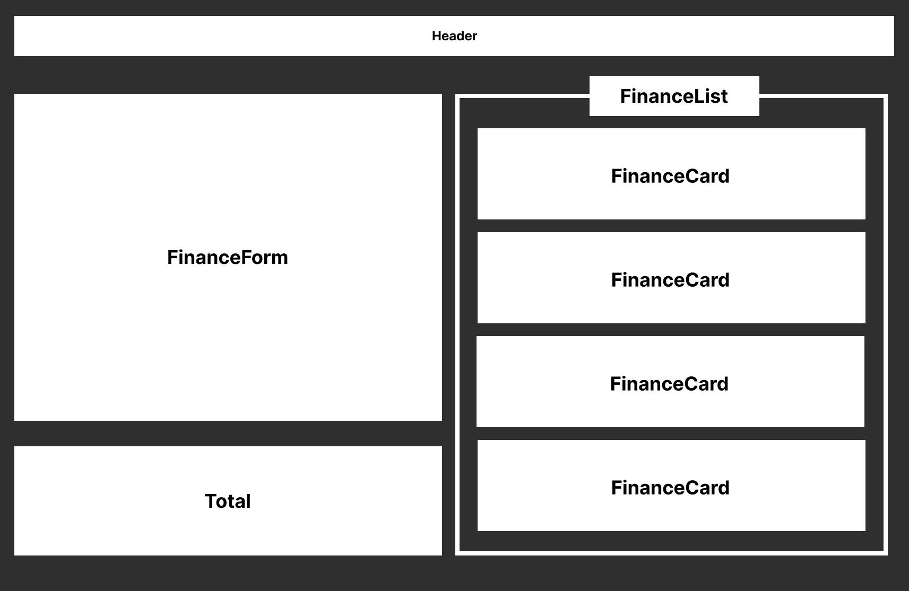

# NuCode - Organizador Financeiro

NuCode é um aplicativo de organização financeira inspirado na simplicidade e eficiência do NuBank. Com uma interface intuitiva, permite que você mantenha controle fácil de suas transações financeiras de forma organizada.

## Funcionalidades Principais

### Adição Rápida de Transações
O NuCode simplifica o processo de registro de transações. Basta preencher um formulário com Descrição, Valor e Tipo de Valor (Entrada ou Despesa). Ao clicar em "Inserir Valor", um card é automaticamente gerado no resumo financeiro.

### Resumo Financeiro Dinâmico
Visualize suas transações em um resumo financeiro claro e conciso. Os cards gerados apresentam todas as informações relevantes, permitindo uma visão geral instantânea de suas finanças.

### Armazenamento Local
As variáveis essenciais são armazenadas utilizando o localStorage, garantindo que seus cards de transações permaneçam salvos mesmo que você saia da página.

### Filtros e Exclusão
Gerencie suas transações facilmente com opções de filtragem. Escolha entre "Todos", "Entradas" ou "Despesas" para focar nas transações desejadas. Além disso, exclua cards com apenas um clique para manter seu resumo sempre atualizado.

### Valor Total Automático
A seção "Valor Total" calcula automaticamente a soma de todos os cards, proporcionando uma visão instantânea do estado financeiro geral.

## Tecnologias Utilizadas
A aplicação foi desenvolvida utilizando React, JavaScript (JSX), HTML e CSS. Todo o código é estruturado de forma componentizada, facilitando a leitura e a manutenção.



## Como Acessar

1. Acesse o Link: https://nucode-nvrc1pqcl-mauibuarque.vercel.app

2. Caso deseje executar a aplicação localmente em sua máquina, clone este repositório.

3. Certifique-se de ter o Yarn instalado e execute os seguintes passos:

   ```bash
   # Instale as dependências
     yarn

   # Inicie a aplicação
     yarn dev

Simples assim! Agora você está pronto para organizar suas finanças com o NuCode.

---

Desenvolvido por: Mauí Buarque
